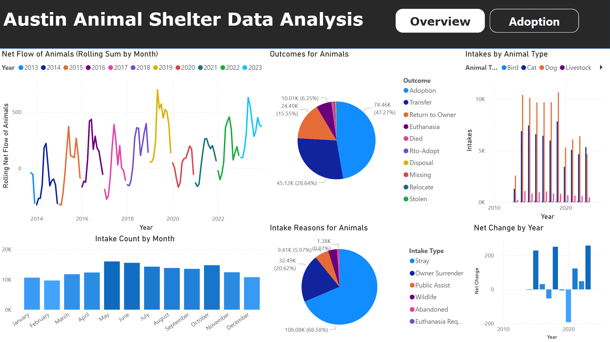
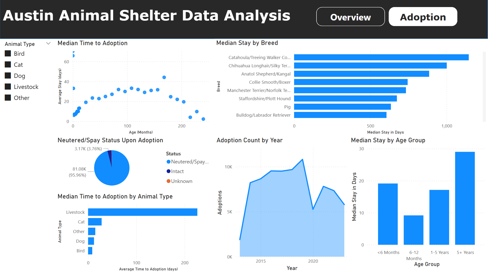

# Austin Animal Shelter Data Analysis

## Overview

Analyzed 10 years of intake and outtake adoption data from the Austin Animal Shelter to uncover trends in animal flow, length in stay, and outcome types by animal.

## Data
- Source: Austin Animal Shelter Data sourced on [Kaggle](https://www.kaggle.com/datasets/thedevastator/austin-animal-center-data?resource=download)
- Time Range: Oct 2013 to Dec 2023
- Contains two files, intake data and outtake data. Intake data includes attributes such as reason for inttake, time intaken, and animal attributes. Outtake data includes attributes such as outtake reason, time outtaken, and other animal attributes.
## PowerBI Dashboard

Overview Page:

Adoption Page:

## Analysis
- SQL queries to extract monthly intake/outtake counts, filter by animal type, etc.
- Power BI dashboard with intake/outcome trends, intake/outtake types, adoption timing, adoption statistics by animal type, and more
 
## Key Insights
- The top intake months are May, June, and October. This could signify extra staffing requirements for those months to ensure animals are processed at an acceptable rate.
- An overwhelming majority (96%) of adopted pets are spayed/neutered due to Austin's mandatory spay/neuter policy.
- Cats have nearly double median time to adoption compared to dogs (28 to 12 days)

## Next Steps
- The intake dataset had a text based location attribute for where the animal was found. This project could benefit from a pipeline that converts the text based input into geographical data to analyse locational trends with intakes
- Explore how promotional events for underadopted pets could reduce median stay.

## Contact
Dylan Kasanders - dkasanders00@gmail.com
  
